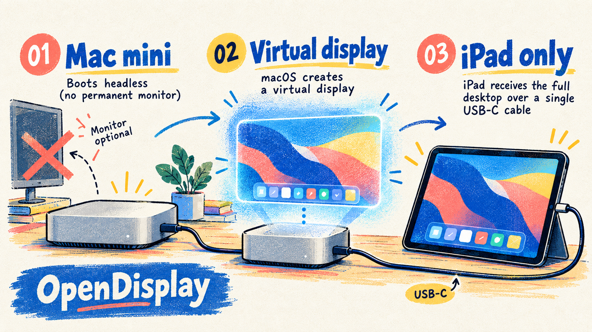

# iPad Headless Display

[skills.sh listing](https://skills.sh/fuego-wtf/ipad-headless-display)

Use a Mac mini with an iPad as its only usable display: no permanent monitor, HDMI dummy plug, subscription, or café Wi-Fi dependency.



This repository packages the reusable Codex skill and a small macOS helper around [OpenDisplay](https://opendisplay.app/). OpenDisplay creates a software virtual display on the Mac, captures it, and streams it to the iPad over a direct USB data cable.

Install the skill with:

```bash
npx skills add fuego-wtf/ipad-headless-display --skill ipad-headless-display
```

## What this solves

The reliable headless flow is:

```text
Mac mini boots and logs in
        ↓
OpenDisplay creates a virtual display
        ↓
iPad receiver gets the desktop over USB-C
        ↓
physical monitor can be unplugged
```

The USB-C cable is the transport. It does not make the iPad appear as a native USB-C monitor by itself.

## Requirements

- macOS 14 or newer; Apple Silicon is preferred.
- iPadOS 15 or newer.
- OpenDisplay sender on the Mac and receiver on the iPad.
- A direct, data-capable USB-C/Lightning cable.
- Screen Recording permission for OpenDisplay; Accessibility permission for touch and scroll input.
- A physical monitor for the first setup and recovery pass.

## Fast start

### 1. Install the receivers

Install the universal iPad receiver from the [App Store](https://apps.apple.com/app/id6754265378). If the App Store is unavailable in your country, use the [official TestFlight invitation](https://testflight.apple.com/join/3NYaY11c). If both are unavailable, build the iPad target from source with a free Apple ID using the [upstream instructions](https://github.com/peetzweg/opendisplay#quick-start-from-source).

### 2. Install the Mac sender

Run the included helper:

```bash
./scripts/setup-opendisplay.sh --install-mac --open-ipad-links
```

The helper downloads the latest signed OpenDisplay release, installs it in `/Applications`, and opens both iPad receiver links.

### 3. Make the first connection

Keep the physical monitor attached. Connect the iPad directly to the Mac mini, unlock it, accept **Trust This Computer**, and open OpenDisplay on the iPad. On macOS, enable OpenDisplay under **System Settings → Privacy & Security → Screen Recording** and **Accessibility**.

In the Mac app, select the iPad and choose **Extend**. Wait for the status `Extending to iPad`. The log should contain `virtual display created` and `mode extend`.

### 4. Go headless

Configure automatic login and OpenDisplay launch at login if the Mac must recover without a monitor. Keep FileVault and sleep settings aligned with the user's security requirements. After Extend mode is verified, unplug only the physical monitor cable. Keep the iPad USB cable connected.

## Mirror versus Extend

Use **Extend** for a headless Mac. Mirror captures the physical monitor; when that monitor is unplugged, macOS can report `Failed to find any displays or windows to capture` and the iPad freezes on the last frame. Extend creates the independent virtual monitor that remains available after the physical monitor is removed.

## Verify and troubleshoot

```bash
./scripts/setup-opendisplay.sh --verify
```

The command checks the sender, USB visibility, and recent OpenDisplay log events. A healthy final state includes `Extending to iPad` and no repeating `Connection lost` messages.

If the iPad is frozen:

1. Reconnect the physical monitor temporarily.
2. Reconnect the iPad with a known-good data cable, directly—not through a hub.
3. Unlock the iPad and reopen its receiver.
4. Restart OpenDisplay and select **Extend** again.
5. Wait for `Extending to iPad`, then unplug only the physical monitor.

Wi‑Fi is an optional fallback on a private network. Café networks often block Bonjour or client-to-client traffic, so USB or a private hotspot/router is preferred.

## Repository layout

- `SKILL.md` — Codex skill instructions and routing.
- `scripts/setup-opendisplay.sh` — install, receiver-link, and verification helper.
- `references/quick-start.md` — compact operational checklist.
- `assets/architecture.png` — generated system illustration for documentation.
- `agents/openai.yaml` — skill UI metadata and default invocation prompt.

## Upstream references

- [OpenDisplay](https://opendisplay.app/)
- [OpenDisplay source and build instructions](https://github.com/peetzweg/opendisplay)
- [Apple Sidecar documentation](https://support.apple.com/guide/ipad/use-your-ipad-as-a-second-display-ipad2b1aa3be/27/ipados/27)

## License

The skill and helper files in this repository are released under the MIT License. OpenDisplay remains a separate upstream project with its own license and terms.
